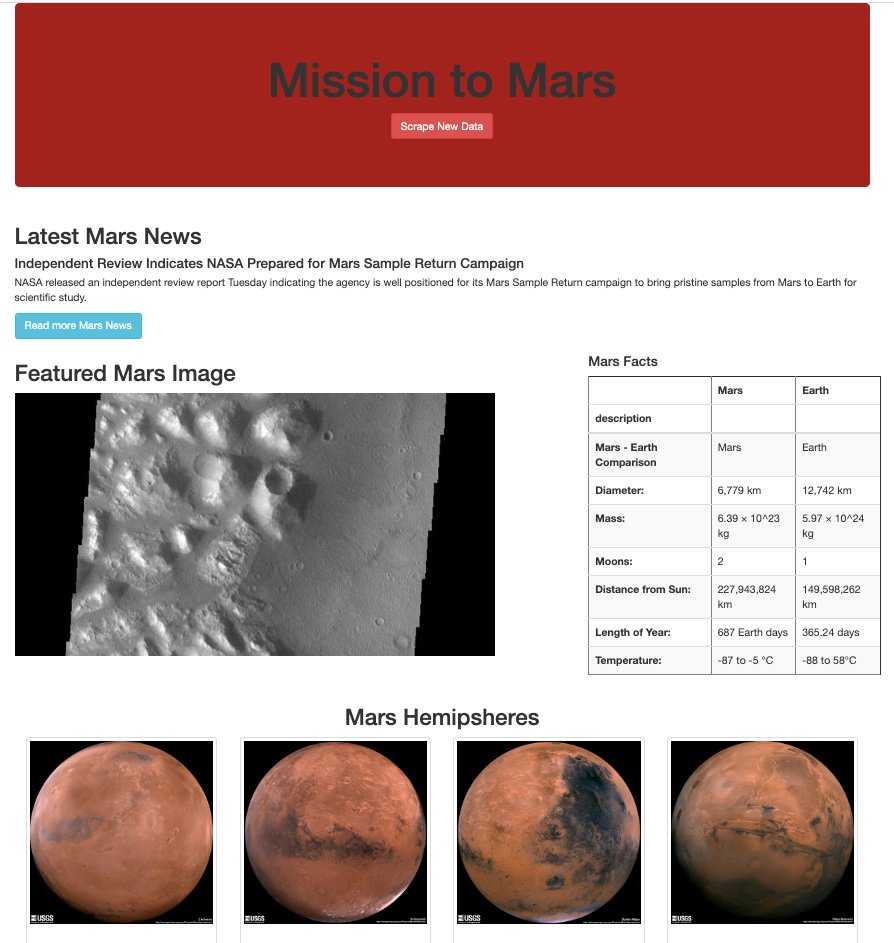

# Mission-to-Mars

## Overview
We built a flask-based web app to house and display Mars facts and images that were scraped from various sites. 

The scraping.py code uses multiple functions to automate the scraping of the websites while our app.py code adds the scraped data to a Mongo database and creates our flask routes for the site. The app.py file also references our index.html code which stylizes the site using bootstrap. 

## Results

The results of the coding work above is a functioning flask web app that easily can scrape various sites for data by simply clicking a button and returning up-to-date info and images. 

We also added an additional button to read more Mars news as well as changes the color of the jumbotron header to reflect the color of the red planet. 

